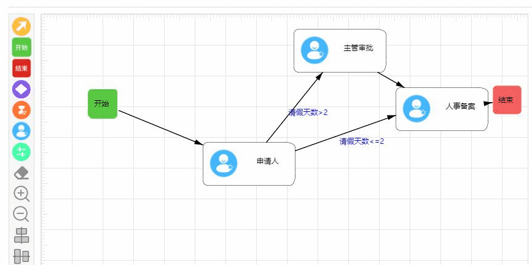
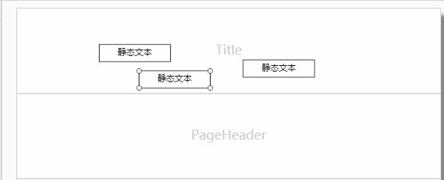

# [Canvas 画布](https://www.runoob.com/jsref/dom-obj-canvas.html)

[参考地址](https://www.aicoder.com/news/5c129496f8afa06e6df8892e/news.html)

[参考地址](https://www.aicoder.com/news/5c1295abf8afa06e6df8892f/news.html)

课件地址： http://learn.fuming.site/front-end/Canvas/

```
应用场景：
1. 把canvas当做动态背景图
2. 小游戏 （代替flash）
3. 统计图表，数据分析结果
```

## 1 canvas 元素

HTML5 新增了的一个画布标签

```
canvas.width
canvas.height
canvas.getContext();  //获取绘图上下文
<canvas width="400" height="300" id="myCanvas">  </canvas>
```

## 2. 使用步骤

```js
// ① 获取canvas 元素
// ② 设置 canvas 大小
// ③ 获取绘图上下文
// ④ 画
```

## 3.Canvas 路径

### 3.1 绘制路径

#### 线段

`moveTo`：直线的起点

`lineTo`：直线的连接点

```
ctx.moveTo(x, y)
ctx.lineTo(x, y)
```

例子：

```
var canvas = document.querySelector('canvas') // 获取元素
var ctx = canvas.getContext('2d') // 获取画布上下文
ctx.beginPath() // 开启路径
ctx.moveTo(100, 100) // 描边起点
ctx.lineTo(300, 200) // 描边连接点
ctx.lineTo(500, 300) // 描边连接点
ctx.closePath() // 闭合路径
ctx.stroke()  // 对路径描边
```

#### 矩形

```
ctx.rect(x, y, width, height);
```

#### 绘制圆(难点)

```js
圆心(X,Y)；半径r；开始角度startAngle；结束角度endAngle
startAngle = 0
endAngle = Math.PI + Math.PI / 2
ctx.arc(x, y, r, startAngle, endAngle, 是否逆时针)  // true 逆时针， false顺时针(默认)
```

#### 圆弧路径

```js
ctx.arcTo(x1, y1, x2, y2, radius)
```

### 3.2 路径描边

`stroke`：描前面没有结束路径【closePath/beginPath】的所有边

[参考](https://www.bilibili.com/video/BV1z4411N7aU?p=33)

```js
ctx.lineWidth = 10 // 设置描边的宽度
ctx.strokeStyle = 'red' // 设置描边颜色
ctx.stroke() // 对路径描边
```

### 3.3 路径填充

```js
ctx.fillStyle = 'red' // 设置填充颜色
ctx.fill() //填充（无论路径是否闭合都会填充）
```

```
(了解) 复杂路径的填充
如何判断一块区域是否填充
从该区域任意画一条无限长的直线，判断经过了几条线
如果经过了奇数条线，肯定会填充
如果经过了偶数条线，判断线的方向 （两个方向的线的数量相等，不填充，正向+1，逆向-1，相加不为0则填充）
```

例子：

如果遇到又要描边又要填充，将填充放前面描边放后面，因为有层级关系，描边会压着填充内容

### 3.4 路径开启

`beginPath`与路径有关，与填充无关

```js
ctx.beginPath() //开启新的路径，并且结束上一次路径

// 每绘制一个图形，都开启一个路径
```

### 3.5 路径闭合

```js
ctx.closePath() // 把最后一个点 和 起点连接
```

### 3.6 设置路径两端的样式

```js
ctx.lineCap = ''
// butt  默认值
// round
// square
```

### 3.7 设置路径连接点的样式

```js
ctx.lineJoin = ''
// miter  默认值
// round
// bevel
```

## 4.快速矩形工具

#### 4.1 快速填充矩形

```js
ctx.fillRect(x, y, width, height) //快速填充矩形
```

#### 4.2 快速描边矩形

```js
ctx.strokeRect(x, y, width, height) //快速描边矩形
```

#### 4.3 清空矩形矩形

```js
ctx.clearRect(x, y, width, height) //快速清空矩形矩形
```

## 5.变换

### 5.1 三种变换效果

```js
ctx.translate(width, height)
ctx.scale(x, y)
ctx.rotate(弧度)
```

```
变换变换整个坐标体系，引起坐标体系变化
只有在变换之后绘制的图形会受到响应
一般各种变换配合，translate和其他配合
```

### 5.2 绘图环境的保存和恢复

```js
ctx.save() // 保存当前环境
ctx.restore() // 绘图上一次保存的环境
```

```
在变换之前，先 save()
变换之后，（一系列绘制） restore()
```

## 6.画图片

在画布上定位图像，并规定图像的宽度和高度：

```js
context.drawImage(img, x, y, width, height)
```

剪切图像，并在画布上定位被剪切的部分：

```js
context.drawImage(img, sx, sy, swidth, sheight, x, y, width, height)
```

[案例](https://developer.mozilla.org/zh-CN/docs/Web/API/Canvas_API/Tutorial/Using_images)

```js
var img = new Image() // 创建img元素
img.onload = function () {
  // 执行drawImage语句(可以画另外的图片或则做一些其他的画线操作)
}
img.src = 'myImage.png' // 设置图片源地址
```

## 7.案例


#### 6.1 计算长度再显示文字[超出第二行显示省略号]

```js
    /**
     *
     * @param {文字} t
     * @param {横坐标} x
     * @param {文字高度} y
     * @param {显示的文字宽度} w
     */
    drawText(t,x,y,w=80){
        let chr = t.split("");
        let temp = "";
        let row = [];
        for(let a = 0; a < chr.length; a++){
            if(this.ctx.measureText(temp).width < w ){
                ;
            }
            else{
                row.push(temp);
                temp = "";
            }
            temp += chr[a];
        }

        row.push(temp);

        // 判断小于2行全部画出来，大于两行显示省略号
        if(row.length < 3){
            for(let b = 0; b < row.length; b++){
                this.ctx.fillText(row[b],x + 10,y+b*16); // 16： 字体大小
            }
        }else{
            row[1] = row[1] + '...'
            this.ctx.fillText(row[0],x + 10,y);
            this.ctx.fillText(row[1],x + 10,y+16);
        }
    }
```

#### 6.2 画一个椭圆边框

```js

/**
 * p:默认边距(矩形转弯的直线长度)
*/
drawOvalBorder(x, y, width, height,p=10,color="#000"){
    let ctx=this.ctx;
    ctx.beginPath();
    ctx.moveTo(x+p,y);
    ctx.lineTo(x+width-2*p, y);
    ctx.quadraticCurveTo(x+width,y,x+width,y+p);
    ctx.lineTo(x+width,y+height-2*p);
    ctx.quadraticCurveTo(x+width,y+height,x+width-p,y+height);
    ctx.lineTo(x+p,y+height);
    ctx.quadraticCurveTo(x,y+height,x,y+height-p);
    ctx.lineTo(x,y+p);
    ctx.quadraticCurveTo(x,y,x+p,y);
    this.setColor(color);
    ctx.stroke();
    this.setColor("#fff");
    ctx.fill();
}
```

#### 6.3 画菱形

```js
drawDiamondBorder(x,y, width = 150, height = 70){
    let ctx=this.ctx;
    ctx.beginPath();
    ctx.moveTo(x + width/2, y);
    ctx.lineTo(x + width, y + height/2);
    ctx.lineTo(x + width/2, y + height);
    ctx.lineTo(x, y + height/2)
    ctx.closePath();
    this.setColor("#ebcafe");
    ctx.fill();
}
```

#### 6.4 全景移动

注:如果是水平移动，canvas 宽度要与图片宽度一样；垂直移动，canvas 高度要与图片高度一样


# 项目实战

## 节点重排



- 在canvas初始化的时候要监听键盘按下Ctrl与键盘抬起的事件(如果不行就换成document监听)

```js
jbInit(e) {
    this.canvas.onkeydown = (e) => {
      this.handleKeyDown(e);
    };
    this.canvas.onkeyup = (e) => {
      this.handleKeyUp(e);
    };
}

/**
   * yx 键盘按下
   */
  handleKeyDown(e) {
    switch (e.keyCode) {
      case 17:
        this.ctrlDown = true;
        // 如果是第一个就加上，如果不是第一个就只执行下面的函数
        if(this.selectArr.length == 0){
          this.selectArr.push(this.ctrlEle)
        }
        break;
      default:
        break;
    }
  }

  /**
   * yx 键盘抬起
   */
  handleKeyUp(e) {
    switch (e.keyCode) {
      case 17:
        this.ctrlDown = false;
        break;
      default:
        break;
    }
  }
```


- 在鼠标抬起时要是否有按下Ctrl键，如果按下就将节点放到数组中(如果已经在数组中就移除不在就添加)

```js
mouseup(e){
    if (this.ctrlDown) {/*如果按下了ctrl*/
        const flag = this.isInZoom(this._selected)
        if(!flag){ // 如果不在数组中那么就添加到选中的数据
          this.selectArr.push(this._selected)
        }else{ // 如果在原来的数据那么就从原来的数组中移除
          this.selectArr = this._removeElementFromArray(this.selectArr, this._selected)
        }
        console.log('如果点中元素不在selected里，就添加，否则从selected里删除，并清空当前元素')
      } else {/*如果没有按下ctrl，直接清空selected，保留当前元素*/
        this.selectArr = [];
        console.log('没有按下ctrl，直接清空selected')
      }
}

/**
   * yx 选中的数组中有无当前的元素
   */
  isInZoom(em) {
    if (em) {
      // 在
      for (let i = 0; i < this.selectArr.length; i++) {
        if (Object.is(em.id, this.selectArr[i].id))
          return true;
      }
      return false
    } else {
      return false;
    }
  }

// 从数组中移除元素
_removeElementFromArray(array, element) {
    for (let i = 0; i < array.length; i++) {
      let em = array[i];
      if (em.id != null && em.id == element.id) {
        return [...array.slice(0, i), ...array.slice(i + 1)];
      }
    }
  }
```

- 如果选中的元素多于两个就可以实现排列
- 给按钮绑定事件，点击时触发不同的函数

```js
/**
   * yx 元素垂直居中
   */
  alignVerticalCenter(){
    if(this.selectArr.length < 2){
      alert('请按下Ctrl并至少选择两个元素')
    }else{ // 获取被选中元素的最大x值和最小x值，y值不变，x取两者的中间值
      const maxX =  Math.max.apply(Math,this.selectArr.map(item => { return item.x }))
      const minX =  Math.min.apply(Math,this.selectArr.map(item => { return item.x }))
      const maxW = Math.max.apply(Math,this.selectArr.map(item => { return item.width }))
      const minW = Math.min.apply(Math,this.selectArr.map(item => { return item.width }))
      const averageValue = (maxX + minX) / 2;
      const averageWidth = (maxW - minW) / 2
      this.abscissaChange(averageValue, maxW, averageWidth)
    }
  }
  /**
   * yx 左对齐
   */
  alignLeft(){
    if(this.selectArr.length < 2){
      alert('请按下Ctrl并至少选择两个元素')
    }else{ // 获取被选中元素的最小x值，y值不变
      const minX =  Math.min.apply(Math,this.selectArr.map(item => { return item.x }))
      this.abscissaChange(minX)
    }
  }
  /**
   * yx 右对齐
   */
  alignRight(){
    if(this.selectArr.length < 2){
      alert('请按下Ctrl并至少选择两个元素')
    }else{ // 获取被选中元素的最小x值，y值不变
      const maxX =  Math.max.apply(Math,this.selectArr.map(item => { return item.x }))
      const maxW = Math.max.apply(Math,this.selectArr.map(item => { return item.width }))
      const minW= Math.min.apply(Math,this.selectArr.map(item => { return item.width }))
      const averageWidth = maxW - minW
      this.abscissaChange(maxX, maxW, averageWidth)
    }
  }
  /**
   * yx 元素水平居中
   */
  alignHorizontalCenter(){
    if(this.selectArr.length < 2){
      alert('请按下Ctrl并至少选择两个元素')
    }else{ // 获取被选中元素的最大x值和最小x值，y值不变，x取两者的中间值
      const maxX =  Math.max.apply(Math,this.selectArr.map(item => { return item.y }))
      const minX =  Math.min.apply(Math,this.selectArr.map(item => { return item.y }))
      const maxH = Math.max.apply(Math,this.selectArr.map(item => { return item.height }))
      const minH = Math.min.apply(Math,this.selectArr.map(item => { return item.height }))
      const averageValue = (maxX + minX) / 2;
      const averageHeight = (maxH - minH) / 2
      this.ordinateChange(averageValue, maxH, averageHeight)
    }
  }
  /**
   * yx 元素顶部对齐
   */
  alignTop(){
    if(this.selectArr.length < 2){
      alert('请按下Ctrl并至少选择两个元素')
    }else{ // 获取被选中元素的最大x值和最小x值，y值不变，x取两者的中间值
      const minX =  Math.min.apply(Math,this.selectArr.map(item => { return item.y }))
      this.ordinateChange(minX)
    }
  }
  /**
   * yx 元素底部对齐
   */
  alignBottom(){
    if(this.selectArr.length < 2){
      alert('请按下Ctrl并至少选择两个元素')
    }else{ // 获取被选中元素的最大x值和最小x值，y值不变，x取两者的中间值
      const maxX =  Math.max.apply(Math,this.selectArr.map(item => { return item.y }))
      const maxH = Math.max.apply(Math,this.selectArr.map(item => { return item.height }))
      const minH = Math.min.apply(Math,this.selectArr.map(item => { return item.height }))
      const averageHeight = maxH - minH
      this.ordinateChange(maxX, maxH, averageHeight)
    }
  }

  /**
   * yx 原元素的横坐标修改(在selectArr中找到elems的所有节点)
   * @param {横坐标} cx 
   */
  abscissaChange(cx, maxX, width=0){
    for(let i = 0; i < this.selectArr.length; i++){
      for(let j = 0; j < this._elems.length; j++){
        if(Object.is(this.selectArr[i], this._elems[j])){
          if(maxX && maxX > this.selectArr[i].width){
            this._elems[j].x = cx+width;
            break;
          }else{
            this._elems[j].x = cx
            break;
          }
        }
      }
    }
    this.repaint()
  }

  /**
   * yx 原元素纵坐标的修改
   * @param {纵坐标} cy 
   */
  ordinateChange(cy, maxH, height=0){
    for(let i = 0; i < this.selectArr.length; i++){
      for(let j = 0; j < this._elems.length; j++){
        if(Object.is(this.selectArr[i], this._elems[j])){
          if(maxH && maxH > this.selectArr[i].height){
            this._elems[j].y = cy+height;
            break;
          }else{
            this._elems[j].y = cy;
            break;
          }
        }
      }
    }
    this.repaint()
  }
```


## 节点对齐时辅助线



- 新建一个辅助线的类AuxiliaryLine

```js
class AuxiliaryLine {
	static instance = null;
	
	static getInstance() {
		if(!AuxiliaryLine.instance || !(AuxiliaryLine.instance instanceof AuxiliaryLine)) {
			AuxiliaryLine.instance = new AuxiliaryLine();
		}

		return AuxiliaryLine.instance;	
	}
	
	constructor() {
		this.points = null;
		this.color = AuxiliaryLine.DEF_COLOR;
	}
	
	paint(g) {
		g.save();
		g.setLineWidth(1);
		g.setColor(this.color);
		
		if(this.points) {
			if(this.points.abscissa) {
				g.drawLine(this.points.abscissa.beginPoint.x, this.points.abscissa.beginPoint.y, 
				this.points.abscissa.endPoint.x, this.points.abscissa.endPoint.y);
			}

			if(this.points.ordinate) {
				g.drawLine(this.points.ordinate.beginPoint.x, this.points.ordinate.beginPoint.y, 
				this.points.ordinate.endPoint.x, this.points.ordinate.endPoint.y);
			}	
		}
		
		g.restore();
	}
	
	getProp(prop) {
		return this[prop];
	}
	
	setProps(newProps) {
		Object.assign(this, newProps);
	}
}

AuxiliaryLine.DEF_COLOR = '#9AFF9A';

export default AuxiliaryLine;
```

- 在绘制元素的同时添加辅助线绘制的方法

```js
paint(){
    // 画元素

    this._elems.forEach((elem) => {
      if (elem instanceof PaintElement) {
        //console.log(elem)
        elem.paint(og);
      }
    });

    //绘制辅助线
		if(AuxiliaryLine.getInstance().getProp('points')) {
			AuxiliaryLine.getInstance().paint(og);
		}
  }
```

在元素拖动坐标出现重合的时候出现辅助线

```js
mouseDrag(e){
    // yx 画辅助线
      const auxiliaryLinePoints = AuxiliaryLine.getInstance().getProp('points');
      const movedX = Math.abs(this._selected.getProp('x') - x); //this._selected选中元素
			const movedY = Math.abs(this._selected.getProp('y') - y);
      if(auxiliaryLinePoints && auxiliaryLinePoints.abscissa && !auxiliaryLinePoints.ordinate && movedX < 3) {
        this._selected.setProps({y: y});
      } else if(auxiliaryLinePoints && !auxiliaryLinePoints.abscissa && auxiliaryLinePoints.ordinate && movedY < 3) {	
        this._selected.setProps({x: x});
      } else if(auxiliaryLinePoints && auxiliaryLinePoints.abscissa && auxiliaryLinePoints.ordinate && (movedY < 3 && movedX < 3)) {
        return false;
      } else {
        // this._selected.setProps({x: x, y: y});
      }
      
      const points = this.getDrawAuxiliaryLinePoint(this._selected);
        
      if(points) {
        AuxiliaryLine.getInstance().setProps({points: points});
      } else {
        AuxiliaryLine.getInstance().setProps({points: null});
      }
}


/**
     * yx获取绘画辅助线的点
     * @target 当前画布中被选中的元素，以此元素的顶点作为基准寻找画辅助线的点
     * @return 绘画辅助线的点，找不到时为空
     */
	getDrawAuxiliaryLinePoint(target) {
		let point = {};
		
		if(!target) {
			return false;
		}
		
      for(let i = 0, len = this._elems.length; i < len; i++) {
				if(!(this._elems[i] instanceof Relation)){
          const result = this._elems[i].getElementConnectionPoint(this._elems, target);
				
          if(result && result.abscissa && !point.abscissa) {
            point.abscissa = result.abscissa;
          }
              
          if(result && result.ordinate && !point.ordinate) {
            point.ordinate = result.ordinate;
          }

          if(point.abscissa && point.ordinate) {
            return point;
          }
        }			
      }
		
		if(!point.abscissa && !point.ordinate) {
			return null;
		} else {
			return point;
		}
	}
```

在鼠标抬起事件中清空辅助线

```js
mouseUp(e) {
    // yx 清空辅助线
    AuxiliaryLine.getInstance().setProps({points: null});
}
```


## 放大缩小画布

使用scale来实现

```js

bigCanvas() {
    let scalePreNum1 = 1 / this.scalePreNum;
    this.canvas.getContext("2d").scale(scalePreNum1, scalePreNum1);
    let scaleNum = this.diagram.getScaleNum("big");
    console.log(scaleNum + "big");

    this.canvas.getContext("2d").scale(scaleNum, scaleNum);
    this.diagram.repaint();
    this.scalePreNum = scaleNum;
  }

 smallCanvas() {
    let scalePreNum1 = 1 / this.scalePreNum;
    this.canvas.getContext("2d").scale(scalePreNum1, scalePreNum1);
    let scaleNum = this.diagram.getScaleNum("small");
    console.log(scaleNum + "small");

    this.canvas.getContext("2d").scale(scaleNum, scaleNum);
    this.diagram.repaint();
    this.scalePreNum = scaleNum;
  }


定义的值 scaleStep = 0.2;
getScaleNum(option) {
    if (option == "big") {
      this.scaleNum += this.scaleStep;
    } else {
      if ((this.scaleNum).toFixed(1) == 0.2) {
        alert('已缩放到最小值')
      } else {
        this.scaleNum -= this.scaleStep;
      }
    }
    return (this.scaleNum).toFixed(1);
  }
```

